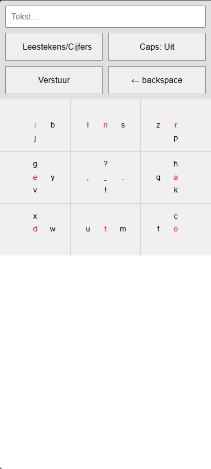
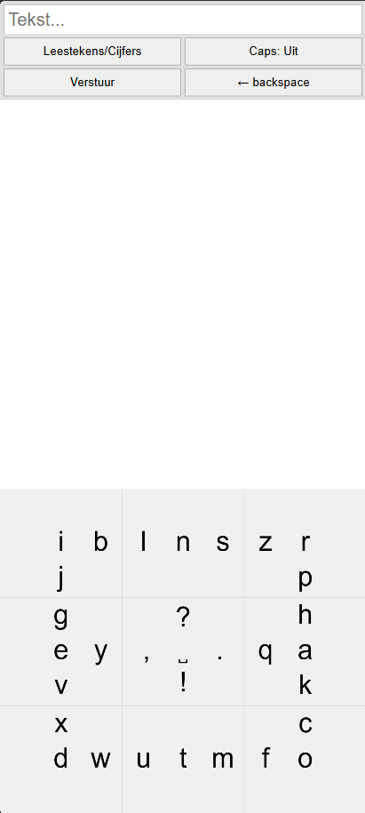
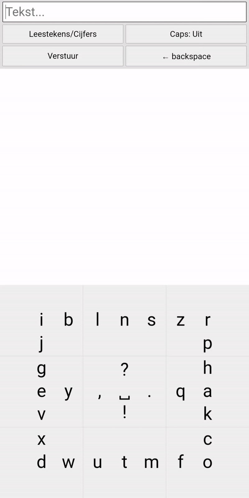
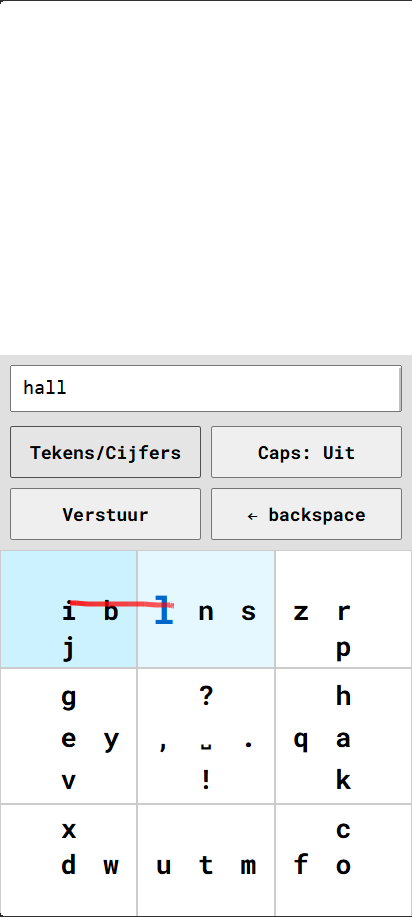
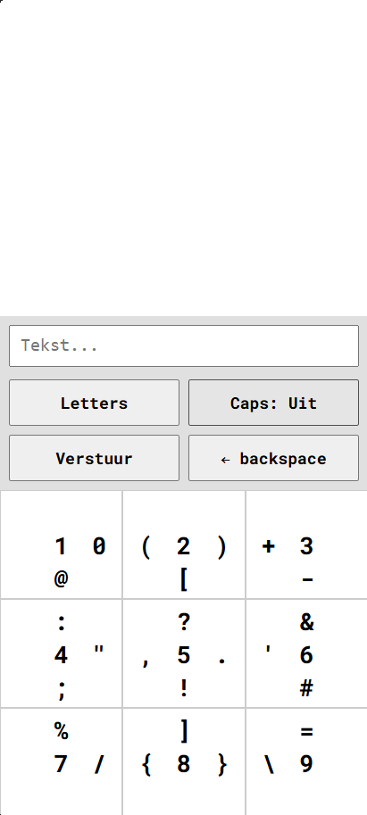

# Human Centered Design

Een toegankelijke oplossing voor mobiel typen – speciaal ontworpen voor en getest met Eric.  
Dit project focust op gebruiksgemak en betrouwbaarheid voor het kunnen typen in een trein die veel beweegt.

---

## Gebruiker: Eric

Eric is een 52-jarige man met een aangeboren fysieke beperking. Hij zit hierdoor in een rolstoel, maar dit houdt hem niet tegen om allerlei activiteiten te doen. Tijdens treinritten gebruikt hij zijn telefoon voor het lezen van scripts, het maken van notities, communicatie en ontspanning. Het toestel dat hij hiervoor het meest gebruikt is zijn google pixel en voor werk heeft hij een iPhone. Typen op een traditioneel toetsenbord is tijdens zo’n rit vrijwel onmogelijk door:

- Hij kan zijn telefoon niet vasthouden en tegelijk typen  
  (legt zijn telefoon neer op een armsteun van zijn rolstoel)
- Hij gebruikt een stylus om zijn telefoon te bedienen  
  (pinchbewegingen of andere meer-vingerige functies zijn onmogelijk)
- De beweging van de trein maakt nauwkeurige input lastig  
  (hoe kleiner het element, hoe moeilijker te raken)
- Spraakbediening werkt niet goed in rumoerige omgevingen  
  (zoals in de trein)
- Schouderbelasting maakt langdurig typen vermoeiend

### Gebruikersbehoeften:

- Groot, betrouwbaar toetsenbord.
- Zo min mogelijk swipen.
- Correct > Snel typen.
- Eenvoudig te leren toetsenbord.
- Woordvoorspelling of eenvoudige spraak optioneel

---

## Week 1

In de eerste week lag de focus op het verkennen van de opdracht, kennismaken met de gebruiker en het bedenken van de eerste ideeën. Door een interview met Eric kregen we inzicht in zijn dagelijkse context, beperkingen en behoeften. Hier heb ik veel uit kunnen halen: ik begreep de opdracht en probleemstelling beter, kreeg een duidelijker beeld van zijn behoeften, maar leerde ook wie Eric als persoon is.

Hierna ben ik verder onderzoek gaan doen naar wat er op dit moment al bestaat aan toetsenborden (digitaal of fysiek), maar ook naar alternatieve vormen van communicatie. Zo kwam ik onder andere op het volgende:

- T9, dat werd gebruikt op oude telefoons met een fysiek toetsenbord  
- Pie menu’s  
- Morsecode  
- Stenografisch toetsenbord

Door verschillende opties af te strepen op basis van Eric zijn behoeften en beperkingen, kwam ik uiteindelijk op het idee voor een toetsenbord met weinig knoppen (raster van 3x3), waarmee je door een combinatie van tappen en korte swipe-bewegingen alle letters kunt typen.

---

## Week 2

Deze week stond in het teken van het bouwen van een eerste functioneel prototype en het testen daarvan met Eric in de trein. Door omstandigheden konden we niet met Eric in de trein testen, dus zijn we overgestapt op een test in de metro. De metro bewoog weliswaar veel minder, maar ik heb toch waardevolle informatie uit de test kunnen halen.

### Prototype 1:

### Prototype-functionaliteit:
Een raster met 9 vlakken, waarbij bij een tik op een vlak de middelste (rode) letter wordt getypt. Wanneer je van een vlak naar een aangrenzend vlak swipet, wordt de letter uit het beginvlak getypt. De code kijkt hierbij naar de laatste twee vlakken waar de gebruiker is geweest, zodat je – als je uitschiet en het scherm nog niet hebt losgelaten – terug kunt swipen naar het beginvlak. 

De rode tapletters zijn de meest gebruikte letters in de Nederlandse taal, omdat tappen nu eenmaal makkelijker is dan swipen.

.gif>)

### Testresultaten:
- Gebruik in begin niet goed te begrijpen maar daarna "Als je het eenmaal weet is het logisch"
- Letters waren te klein, vooral sommige leestekens  
- Bij langdurig swipen bleef er een lange lijn staan die visueel de letters blokkeerde  
- De rode letters maakten niet duidelijk dat ze bedoeld waren voor tappen en belemmerden de functionaliteit  
- Het was onduidelijk welke letter op dat moment geselecteerd werd (vooral tijdens het swipen)  
- Grote vlakken waren prettig, maar mochten nog groter  
- Het toetsenbord mocht verplaatst worden naar de onderkant van het scherm voor makkelijker gebruik

---

## Week 3

Tussen de test van week 2 en de test van week 3 hadden we eigenlijk vrij weinig tijd voor verbeteringen. Toch heb ik mijn eerste paar aanpassingen kunnen toevoegen. Deze week zouden we eigenlijk echt in de trein testen, maar doordat de rolstoel stuk was, kon Eric er niet bij zijn. Daarom zijn wij elkaars prototypes gaan testen, dit keer in de trein naar Utrecht.

Hier kwam ik er al snel achter dat op dit traject de trein erg heftig schommelt. Op de heenweg zaten we in het deel waar de rolstoel normaal ook zou staan, en daar heb ik dan ook getest. Op de terugweg zaten we onderin de trein, en daar was de schommeling veel minder.

Door deze schommeling, het gebruik van je pinkvinger en het laten vasthouden van je telefoon door iemand anders, hebben we toch nog goed kunnen testen.

### Prototype 2:
 

### Aangepast:
- Raster naar beneden gehaald
- Letter groote verhoogd
- Swipe lijn met een fade-out

### Testresultaten:
- Tekstvlak en knoppen ook naar beneden verplaatsen  
- Je kunt niet snel veel verwijderen, omdat het dan als een double tap wordt gezien en de telefoon inzoomt  
- Nog duidelijker weergeven welke letter gekozen wordt  
- De doorgaande swipefunctie werkte fijn in een bewegende trein  
- Bij swipen ook de optie willen hebben om de tapletters te selecteren
- Knoppen (backspace, caps, verstuur en leestekens) te klein
- Swipe lijn mocht korter

---

## Week 4

In deze laatste week heb ik de laatste toevoegingen gedaan in de tijd die ik had. We hebben dit in een klaslokaal getest met Eric, omdat er die dag ook eindgesprekken waren voor een ander vak, waardoor er geen tijd was om in de trein te testen. Toch heb ik waardevolle informatie opgedaan die ik, als ik meer tijd had gehad voor dit vak, had kunnen toepassen en opnieuw had kunnen testen tot een compleet eindproduct.

Over het algemeen ben ik tevreden met het laatste prototype en heb ik positieve feedback gekregen van Eric.

### Prototype 3:
 

### Aangepast:
- Beter leesbaar font toegevoegd (bijv. beter verschil tussen hoofdletter i en kleine letter l)  
- Knoppen vergroot en naar beneden geplaatst  
- Swipe-lijn fade-out korter gemaakt  
- Tekst springt omhoog bij veel tekst  
- Functie toegevoegd om letters te schalen en blauw te kleuren als ze actief zijn  
- Blauwe vlakken voor de laatste twee vakken beter weergegeven  

### Testresultaten:
- Letter­schaling was prettig, maar wordt soms geblokkeerd door de stylus  
- Blauwe vlakken waren een goede toevoeging  
- Verstuurknop mag beter vervangen worden door een ‘tekst kopiëren’-knop  
- Witte ruimte had beter benut kunnen worden  
- Tekst selecteren werkt niet goed (backspace verwijdert alleen het laatste teken, niet de geselecteerde tekst; selecteren van een deel lukt niet)

---

## Als er meer tijd was dan had ik:

- Meer onderzoek gedaan naar letter positie
- Letter highlite functie in het gedeelte met wit ruimte groot zetten, en kunnen testen
- Verstuur knop verandere in meer functionele gebruik zoals een het kunnen kopieren van tekst naar een ander app
- Visueel wat sterker maken
- Basis prenciepe toetsenbord duidelijk maken zonder dat er uitleg voor nodig is
- Tekst beter kunnen selecteren en aanpassen
